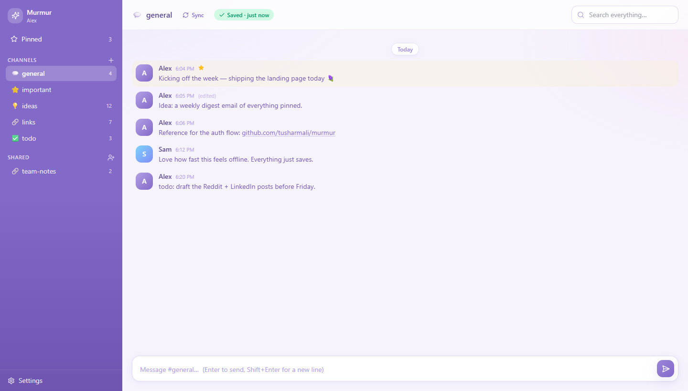
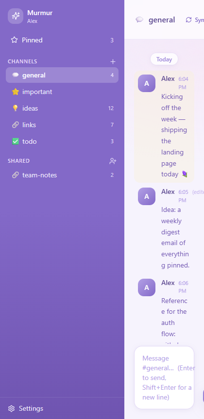
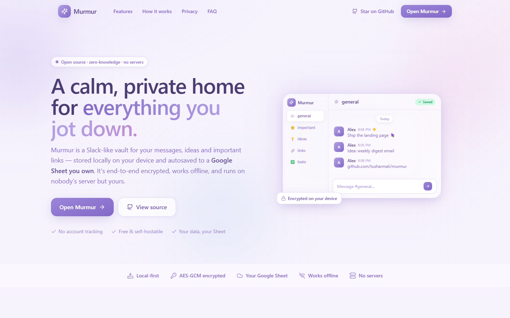

<div align="center">

# Murmur 🪻

**A calm, private, local-first home for your messages and notes.**

Local-first · end-to-end encrypted · autosaved to a Google Sheet _you_ own · no servers · open source

[](https://murmur-chat.vercel.app)
[](LICENSE)
[](https://nextjs.org)
[](#-install-as-an-app-pwa)

[**Open the app →**](https://murmur-chat.vercel.app/app) &nbsp;·&nbsp; [Deploy your own](#-deploy-your-own-one-click) &nbsp;·&nbsp; [How it works](#architecture)

<br/>



</div>

---

A **Slack-like** place to keep your messages & important items — with a privacy model most note apps don't have:

- 🗂 **Local-first.** Everything is stored in your browser as **date-wise JSON** (IndexedDB), one blob per day.
- ☁️ **Autosaved to *your own* Google Sheet** via a Google Apps Script you deploy. Your data never touches a server we run.
- 🔐 **100% private.** Each user's connection to their private sheet (URL + secret token) is **encrypted in the browser** with a key derived from their password. The master sheet that handles login stores only ciphertext — even its owner can't read your data or where it lives.
- 🔄 **First login pulls your whole history** date-by-date (newest → oldest) so every device stays in sync.
- 📲 **Installable PWA** that works offline, and a soft purplish-pastel UI. Deploys to **Vercel** with zero server secrets.

---

## 🚀 Deploy your own (one-click)

[](https://vercel.com/new/clone?repository-url=https%3A%2F%2Fgithub.com%2Ftusharmali%2Fmurmur&env=NEXT_PUBLIC_MASTER_SCRIPT_URL&envDescription=Your%20master%20Apps%20Script%20Web%20App%20URL%20(see%20README%20step%201)&envLink=https%3A%2F%2Fgithub.com%2Ftusharmali%2Fmurmur%23setup&project-name=murmur&repository-name=murmur)

1. Click the button — Vercel forks the repo and asks for one env var, **`NEXT_PUBLIC_MASTER_SCRIPT_URL`**.
2. Paste your **master Apps Script Web App URL** (deploy it first — see [Setup step 1](#1-deploy-the-master-script-once)). Setting it here hides the endpoint-setup screen so your users only ever see sign in / create account.
3. Deploy. That's it — your instance is live, and each user still deploys their own private Sheet at signup.

> Don't have the master URL yet? Deploy the app with it blank, and the app will prompt you for it once on first run (fine for local dev; set the env var for production).

---

## 📲 Install as an app (PWA)

Murmur ships as an installable **Progressive Web App**. On desktop Chrome/Edge, click the install icon in the address bar; on iOS Safari, **Share ▸ Add to Home Screen**. It launches in its own window, keeps a branded icon, and — because it's local-first — your notes stay available even fully offline.

## Screenshots

<p align="center">
  
  &nbsp;&nbsp;
  
</p>

---

## Architecture

```
Browser (Next.js on Vercel)
   │  PBKDF2 → AES-GCM (key never leaves device)
   ├── MASTER Apps Script  ──►  master Google Sheet   (auth: email, salt, verifier, encrypted-connection)
   └── USER  Apps Script   ──►  user's private Sheet  (the actual messages — owned by the user)
Local: IndexedDB  →  date-wise JSON + offline sync queue
```

There are **two** Apps Scripts:

| Script | Who deploys it | Stores |
| --- | --- | --- |
| `apps-script/master.gs` | You (the app operator), once | Users table (auth only, no readable data) |
| `apps-script/user.gs` | Each user, into their own Sheet | That user's messages — their private DB |

---

## Setup

### 1. Deploy the master script (once)
1. Create a new Google Sheet → **Extensions ▸ Apps Script**.
2. Paste `apps-script/master.gs`. Save.
3. **Deploy ▸ New deployment ▸ Web app** → *Execute as:* **Me**, *Who has access:* **Anyone**.
4. Copy the **Web app URL**.

### 2. Run / deploy the app
```bash
npm install
npm run dev      # http://localhost:3000
```

**Routes:** `/` is the public landing page, `/app` is the vault itself (sign in /
create account), and `/privacy`, `/terms`, `/security` are the policy pages.
Visitors land on `/` and click **Open Murmur** to reach `/app`.

**For a hosted deployment, set the master URL as an env var.** When
`NEXT_PUBLIC_MASTER_SCRIPT_URL` is present, the master-endpoint setup screen is
**completely hidden** — your users never see or change it; they only see sign in /
create account:
```
NEXT_PUBLIC_MASTER_SCRIPT_URL=https://script.google.com/macros/s/…/exec
```
(If you leave it blank — e.g. local dev — the app prompts once and stores the URL
in the browser. Don't ship it blank.)

Deploy to Vercel: push to GitHub, import the repo, add the env var in
**Project ▸ Settings ▸ Environment Variables**, deploy.

### 3. Each user deploys their private script
1. Create a new Google Sheet → **Extensions ▸ Apps Script**.
2. Paste `apps-script/user.gs`, set `TOKEN` to a long random string. Save.
3. **Deploy ▸ New deployment ▸ Web app** → *Execute as:* **Me**, *access:* **Anyone**.
4. In Murmur, **Create account** with the Web app URL + that TOKEN.

> Murmur pings the private script before creating the account, so a wrong URL/token is caught immediately.

---

## Features
- Channels (add your own), messages grouped by **date dividers**
- Pin / edit / delete / copy, a **Pinned** view, and full-text **search** across all days
- Offline-first: writes save locally instantly, then sync to your Sheet (queue + status badge)
- Re-sync and **Export all JSON** from Settings
- Auto-linkified URLs

## Shared channels (access control)
Any channel can be shared so others can read & post:

- **Share** a channel (hover it → 🔗). Murmur gives the channel a global id, stores
  its connection **encrypted with a per-channel key** in the master sheet, and shows you an
  **invite code** (`channelId~key`). The key lives only in the code — the master sheet can't read it.
- **Join** with a code (Shared section → 👤+). The channel appears in your sidebar and starts
  syncing. Shared-channel messages read/write against the **owner's** sheet, tagged with the author.
- **Access list** (hover a shared channel → 👥): the owner sees every member, can **add by email**
  or **remove** access; members can see who's in. Everyone's channel keys ride along in an
  **encrypted keyring** so shared channels follow you across devices after a password login.

> Note: removing a member stops them appearing in the list, but anyone who already has the invite
> code keeps the key. For a hard cut-off, "Stop sharing" the channel and re-share to rotate the key.

## Security notes
- Passwords are never sent anywhere — only a derived verifier (a hash of a *different* PBKDF2 segment than the encryption key).
- The private-sheet URL + token are AES-GCM encrypted client-side; losing your password means the encrypted blob can't be recovered (re-link your sheet by re-registering).
- The `user.gs` TOKEN gates writes to a user's sheet — keep the URL + token secret.
- The session (decrypted connection) is kept in `localStorage` on the user's own device for convenience; sign out to clear it.

## Extending
The data model (`src/lib/types.ts`) and the private script (`apps-script/user.gs`) are small and additive — add `type: "item"` views, attachments, reminders, reactions, etc.

## License
Apache License 2.0 — see [LICENSE](LICENSE) and [NOTICE](NOTICE). You're free to use, modify, self-host, and redistribute Murmur; the license includes an explicit patent grant and requires you to preserve attribution.
